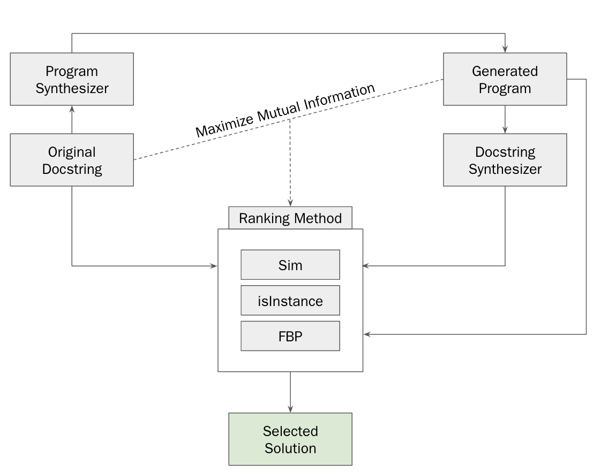

# Maximal Mutual Information Reranking Enables Better Program Synthesis

> *Large language models fine-tuned on code have exhibited their potential to tackle a wide range of programming
tasks. However, their performance is far from perfect. State of the art off-the-shelf coding models significantly
lag behind human programming performance on non-trivial challenges. While collecting more data and
developing larger models is likely a valid approach to squeezing out better performance, here we investigate
training-free and data-free methods for improving LLM program synthesis quality. To do so, we first introduce
the guiding objective of maximizing mutual information between natural language intents and generated
programs. Under this framework, we then instantiate three specific novel methods to maximize mutual
information and improve program synthesis. Our results on HumanEval indicate that these approaches have
the potential to improve performance of LLMs for program synthesis.*

In brief, we introduce the following maximal mutual information ranking framework to improve program synthesis performance:



Under this framework, we introduce the following three maximal mutual information ranking methods:

1. Docstring Cycle-Consistency
2. The isInstance() Characteristic
3. Forward-Backward Conditional Product

Our best-performing methods improve CodeGen2-7B absolute performance on HumanEval by 4%, for a relative improvement of 28.57% over a random baseline.

To seamlessly reproduce all experiments, run the following:

```bash experiments.sh```